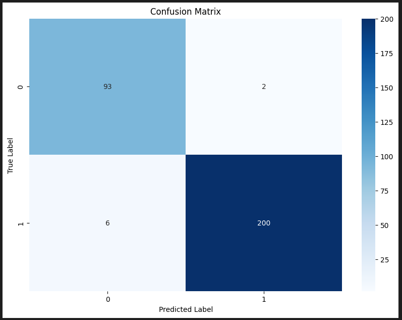
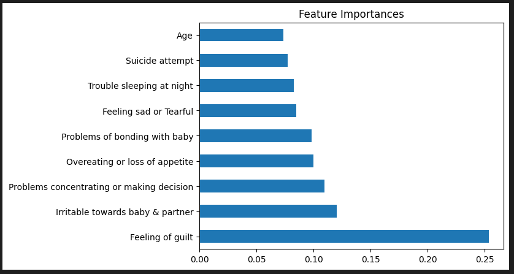
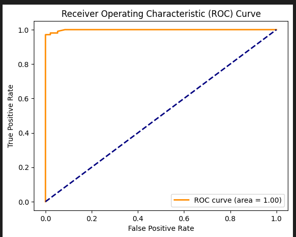
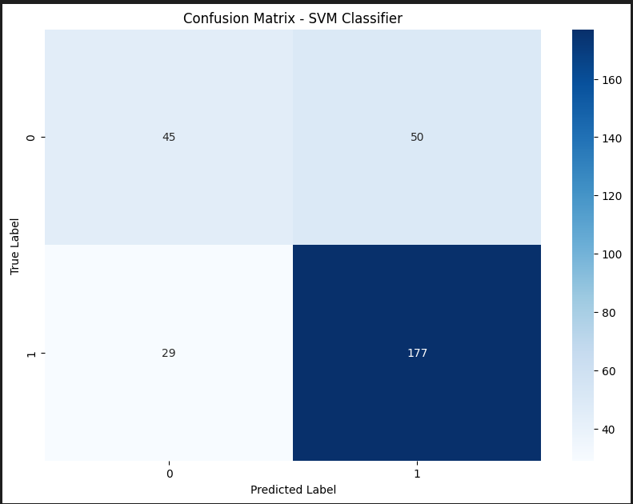
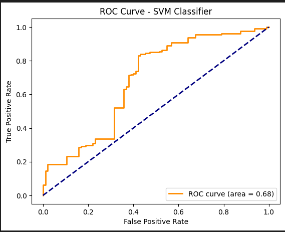
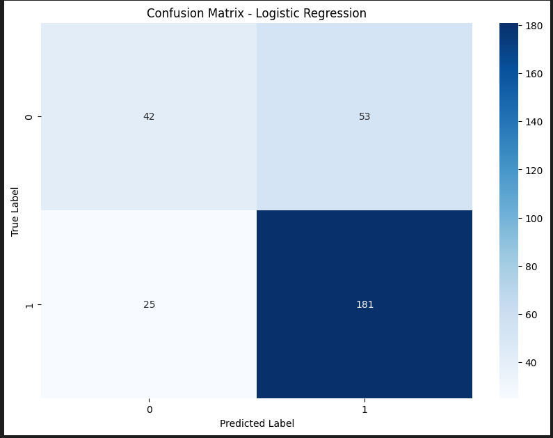
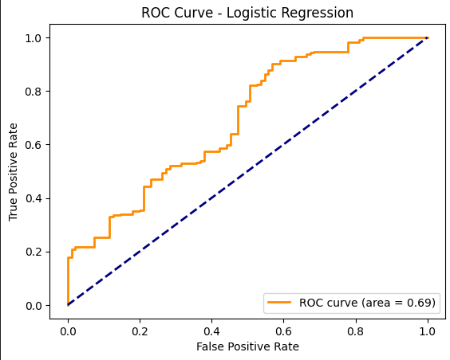

# Postpartum Depression Classification

This document presents the classification results for a study on postpartum depression. Three different models were evaluated: Random Forest, Support Vector Machine (SVM), and Logistic Regression.

---

## Model Evaluations

### Random Forest

- **Accuracy**: 0.97
- **Precision**: Weighted average of 0.97
- **Recall**: Weighted average of 0.97
- **F1 Score**: Weighted average of 0.97

#### Confusion Matrix

#### Feature Importance

#### ROC Curve

### Support Vector Machine (SVM)

- **Accuracy**: 0.74
- **Precision**: 0.73
- **Recall**: 0.74
- **F1 Score**: 0.73

#### Confusion Matrix

#### ROC Curve

### Logistic Regression

- **Accuracy**: 0.74
- **Precision**: 0.73
- **Recall**: 0.74
- **F1 Score**: 0.73

#### Confusion Matrix

#### ROC Curve

---

## Data Overview

The dataset comprises various attributes related to postpartum depression symptoms and behaviors. Here is a summary of the unique attributes:

- **Age**: ['35-40', '40-45', '30-35', '45-50', '25-30']
- **Feeling sad or Tearful**: ['Yes', 'No', 'Sometimes']
- **Irritable towards baby & partner**: ['Yes', 'No', 'Sometimes']
- **Trouble sleeping at night**: ['Two or more days a week', 'No', 'Yes']
- **Problems concentrating or making decision**: ['Yes', 'No', 'Often']
- **Overeating or loss of appetite**: ['Yes', 'No', 'Not at all']
- **Feeling of guilt**: ['No', 'Yes', 'Maybe']
- **Problems of bonding with baby**: ['Yes', 'Sometimes', 'No']
- **Suicide attempt**: ['Yes', 'No', 'Not interested to say']

Data provided by [Md Parvez Mosaraf](https://www.kaggle.com/parvezalmuqtadir2348)

---

